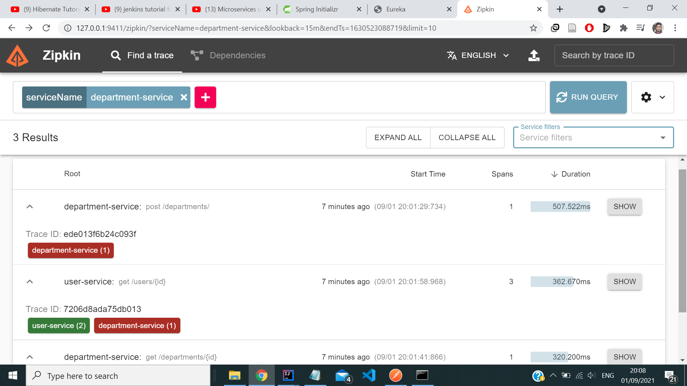

# Microservices-Using-Spring-Boot

1) In this project, We're Implementing Microservice Architecture in SpringBoot which is as follows:

2) First will create Department Service which is as follows:
- first we go to Spring initializr and install dependencies Spring web, Spring JPA, H2 and Lombok [Spring-Boot](https://start.spring.io/)
- So, In this service we created two methods. so first method is create to save the department Using Post method.

.png "Department Service")

- Second method is for to Get the department in this method we're passing the department Id which we generated in Post method.

3) We will create the User Service which is as follows:
- first we go to Spring initializr and install dependencies Spring web, Spring JPA, H2 and Lombok.
- So, In this service we created two methods. so first method is create to save the User using the Post method.

- Second method is for to Get the User along with it's Department which he belongs to using Get method where we passing the user Id which we
genrated in Post method.

4) Implementing service registry:
- first we go to Spring initializr and install dependencies Eureka Server
- We create Service registry so that all microservice will connect to that particluar regsitry to get know the what are available microservices and status
port information, what are the URLs of all microservices which is as follows:

5) Implementing API gateway
- first we go to Spring initializr and install dependencies Eureka Server, Gateway and Spring Boot Actuator.
- we create API gateway so all the client requests shouldn't go to microservices directly. there should be going through one API gateway from there
they should traverse according to microservices URL pattern and other information as well.
- This API gateway is responsible to traverse through appropriate microservices.

- We test all requests using Postman in which we POST and GET requests done for both user and department service using localhost:9191 url.

6) Implementing Circuit Breaker
- In cloudGatewayApplication we're implementing hystrix service so for that we add hystrix dependencies in spring initializr and we go to explore and we copy
hystrix dependency in pom.xml file of cloud-gateway.
- we will create the fallback controller and whenever our service is down will redirected to that controller. for this will create a new class namely as
FallBackMethodController. in this we created two methods for when user or dept microservice is slow or failed or taking longer time we call this 
fallback methods. will add filters in application.yml file.
- Will add hystrix configuration in that will add timeout as 4sec if i don't get any response from service within 4 sec it will forward to either 
departmentservicefallback method or userservicefallback method and will add configuration for actuate server we enable hystrix.stream for hystrix dashboard

7) Implementing Hystrix Dashboard
- first we go to Spring initializr and install dependencies Eureka Discovery client and hystrix dashboard.
- we create application.yml file and default server port is 9295 and spring application name, eureka client configuration and hystrix dashboard config
we strated all service and hystrix dashboard and rerun the page localhost:8761. it will display hystrix dashboard.
- then will go to URL localhost:9295/hystrix and check them using postman.

8) Implementing Cloud Config Server
- first we go to Spring initializr and install dependencies Eureka Discovery client and Config server.
- we create application.yml file and default server port is 9296 and spring application name.
- create new github repository name as [config-server](https://github.com/praddy18597/config-server/commit/3b636bf151a2d1a3875ab9dfdce21b0617ac34f8). 
will create new file application.yml file in that we copy eureka client config.
- for this github repo we need to add configuration in application.yml file and add github uri in uri section. then we go to all microservices add this 
spring-cloud-starter-config dependency in the pom.xml file.
- now only for cloud configuration we create bootstrap.yml file for all services and registry. start all the services etc. will go to localhost:8761
and refresh the page and check them using postman.

9) Implementing zipkin and sleuth library
- for zipkin server we went to [zipkin](zipkin.io) website. will download the jar file and start zipkin server in cmd
C:\Users\prade\OneDrive\Documents\Springboot Microservices\department-service 
it will generate the zipkin URL 127.0.0.1:9411/zipkin/

-In next step we explore zipkin and sleuth dependency in spring initializer. we add this dependencies in pom.xml file of user and dept service. 
-now we point both service to zipkin server. In application.yml file of department service add zipkin-base-url and same will add in user service as well.
after this refresh the page localhost:8761 and run all the commands in postman.

